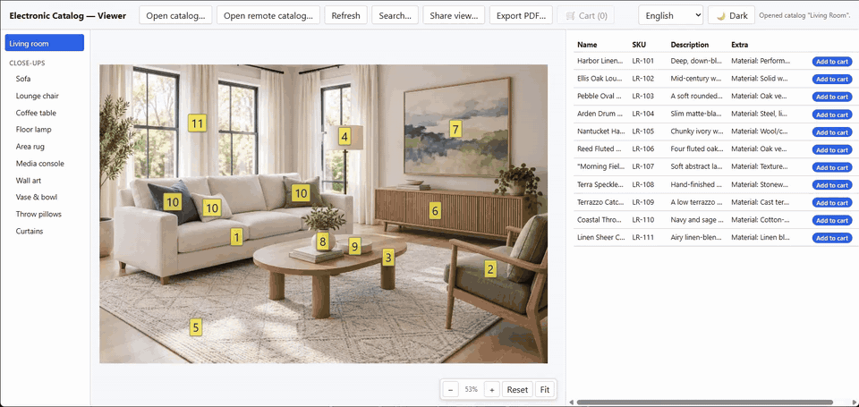

# Electronic Catalog Maker

[](https://github.com/alexandrkotov)
[](LICENSE)


[](#agent-ready-webmcp)

**Turn any picture into a clickable catalog.** Put hotspots on a photo or a
diagram, link each one to a row of data (name, SKU, description, a Buy
link), and keep the whole thing in one portable `.ecatm` file (Electronic
CATalog Maker). No backend, no account, nothing to install —
**[try the live demo](https://tapalog.com/viewer/?src=https%3A%2F%2Ftapalog.com%2Fdemo%2Fliving-room.ecatm)**
or visit **[tapalog.com](https://tapalog.com/)**.

<p align="center">
  <a href="https://tapalog.com/"></a>
</p>

- **One file.** A catalog is a SQLite database with its images embedded —
  email it, put it on a USB stick, host it as a static file, or embed it in
  another page with `<ecm-viewer>`.
- **Runs in the browser.** Editing and viewing happen locally via
  [sql.js](https://github.com/sql-js/sql.js); nothing is uploaded unless you
  choose to share a link. After the first visit the editor and viewer keep
  working without a connection, and both install as desktop apps.
- **Pictures link to data.** Diagrams, room photos, floor plans, anatomy
  charts: a hotspot opens its table row, a Buy link, or another image.
- **Private when you need it.** Password-protected catalogs are encrypted
  client-side (AES-GCM), so a static host never sees the contents.
- **Print and sell.** Export an A4 PDF with a QR code per item, or add a Buy
  button that works with your existing checkout.
- **Free and open source** (MIT).

## Who it's for

Each one opens a live demo, nothing to install:

- **Furniture and home goods** — shop the look: tap a piece in a room photo
  to see its details and a Buy button.
  [Demo](https://tapalog.com/viewer/?src=https%3A%2F%2Ftapalog.com%2Fdemo%2Fliving-room.ecatm)
- **Parts and equipment** — exploded views linked to part numbers: the
  number on the diagram matches the row in the table.
  [Demo](https://tapalog.com/viewer/?src=https%3A%2F%2Ftapalog.com%2Fdemo%2Fauto-spare-parts.ecatm)
- **Paid and members-only catalogs** — sell a guide or a course as a
  password-protected file (demo password: `stool-2026`).
  [Demo](https://tapalog.com/viewer/?src=https%3A%2F%2Ftapalog.com%2Fdemo%2Fdiy-stool-en.ecatm)
- **Teaching and learning** — explorable diagrams for lessons, no student
  accounts. [Schools page](https://tapalog.com/schools.html)
- **Gyms and fitness** — pick a muscle group, find the machine, print a
  workout.
  [Demo](https://tapalog.com/viewer/?src=https%3A%2F%2Ftapalog.com%2Fdemo%2Ffitness-en.ecatm)
- **Services and booking** — a photo list of services: pick one, read how
  it goes, and Book opens a booking calendar (a demo one here).
  [Demo](https://tapalog.com/viewer/?src=https%3A%2F%2Ftapalog.com%2Fdemo%2Fcosmetologist-en.ecatm)
- **Local pros on a map** — a map of the area with a marker for every pro;
  each marker opens that pro's page with services, prices and Book. Built
  with Map Composer.
  [Demo](https://tapalog.com/viewer/?src=https%3A%2F%2Ftapalog.com%2Fdemo%2Fnail-techs-en.ecatm)
- **Tests and self-check** — answer options sit on the picture, with a
  running score.
  [Demo](https://tapalog.com/viewer/?src=https%3A%2F%2Ftapalog.com%2Fdemo%2Fquiz-citizenship-en.ecatm)

## What a catalog can be

Every catalog is one pick from each of four levels: how you move between
pictures, what is on a picture, how an item's data is shown, and what a tap
does. The same levels are a section of the
[landing page](https://tapalog.com/#types-h), also in
[Russian](https://tapalog.com/ru/#types-h) and
[Ukrainian](https://tapalog.com/uk/#types-h).

<p align="center">
  <a href="https://tapalog.com/#types-h"></a>
</p>

## How the apps fit together

One file format, several ways to use it: the **editor** builds a catalog,
the **Grid Composer** builds a whole tile catalog in one go from a folder of
photos and a spreadsheet (the **Store Importer** can pull both straight out
of your online store), the **viewer** opens one as its own full-page app,
and `<ecm-viewer>` embeds that same viewer into any other page — even a
plain static HTML file with no build step of its own (see "Embedding the
viewer" below).

The same map is on the [landing page](https://tapalog.com), also in
[Russian](https://tapalog.com/ru/toolset.svg) and
[Ukrainian](https://tapalog.com/uk/toolset.svg):

<p align="center">
  <a href="landing/toolset.svg"></a>
</p>

## Getting started

Just want to use the apps? They're hosted, free, nothing to install — see
the **[project site](https://tapalog.com/)**,
or jump straight in:

- **[Editor](https://tapalog.com/editor/)**
- **[Viewer](https://tapalog.com/viewer/)**
- **[Grid Composer](https://tapalog.com/composer/)** — a folder of photos
  plus a spreadsheet → a ready tile catalog (see "Building a tile catalog
  from photos and a table" below)
- **[Map Composer](https://tapalog.com/map-composer/)** — a map plus your
  places → a catalog where every point opens its own page (see "Building a
  catalog from a map" below)

All of them run entirely in your browser — nothing you build gets uploaded
anywhere unless you explicitly open a catalog from a URL (see "Sharing a
catalog via link" below); a saved `.ecatm` file lives on your own disk.

No catalog file of your own yet? Try a demo, no install or download
needed — [Auto parts](https://tapalog.com/viewer/?src=https%3A%2F%2Ftapalog.com%2Fdemo%2Fauto-spare-parts.ecatm)
(an anonymized catalog of exploded-view truck-part diagrams) or
[Furniture](https://tapalog.com/viewer/?src=https%3A%2F%2Ftapalog.com%2Fdemo%2Ffurniture.ecatm)
(real photos, a smaller catalog to browse), or a
[password-protected one](https://tapalog.com/viewer/?src=https%3A%2F%2Ftapalog.com%2Fdemo%2Fdiy-stool-en.ecatm)
(a DIY guide; the password, `stool-2026`, is public on purpose).

To develop the project instead (or run it without depending on that
hosted copy), it needs two ordinary developer tools installed once:

- [Node.js](https://nodejs.org/) 18 or later
- [pnpm](https://pnpm.io/installation)

Then, from a terminal:

```bash
git clone https://github.com/alexandrkotov/electronic-catalog-maker.git
cd electronic-catalog-maker
pnpm install
pnpm dev:editor   # http://localhost:5173
pnpm dev:viewer   # http://localhost:5174 — run in a second terminal
```

(There's a third one, `pnpm dev:embed`, for developing the embeddable
`<ecm-viewer>` component — see "Embedding the viewer" below; most people
just want the two above.)

That's genuinely everything: no `.env` file, no database to point at,
nothing else to configure. Each command starts a local dev server and
prints its URL; leave it running and open that URL in a browser. A
catalog file lives entirely on your own disk — nothing is ever uploaded
anywhere unless you explicitly load one from a URL (see "Sharing a
catalog via link" below).

## Installing as an app

Both apps are installable — entirely optional, and nothing you can't also
just do in an ordinary browser tab. On the editor or viewer page, Chrome
and Edge show an install icon in the address bar (or offer it from the
browser's menu); confirming it adds a real desktop app with its own icon
and window, no app store involved. Editor and Viewer install separately —
pick one, or both.

This changes nothing about how either app behaves: same catalog format,
same offline-first, browser-only logic, just launched from your desktop
instead of a bookmark. Uninstalling is the same as any other app installed
this way (right-click its icon, or the browser's own app-management page).

Both apps are also on the Microsoft Store for Windows, if you'd rather
install from there:
**[Editor](https://apps.microsoft.com/detail/9p4zk48txrln?hl=en-US&gl=US)**,
**[Viewer](https://apps.microsoft.com/detail/9nb4shzt8fd1?hl=en-US&gl=US)**.
So is [Grid Composer](https://apps.microsoft.com/detail/9n9s9k9fhlk2?hl=en-US&gl=US)
(see "Building a tile catalog from photos and a table").
So are the three optional apps you run yourself — the
[Collaboration Server](https://apps.microsoft.com/detail/9nfr1svn0zf6?hl=en-US&gl=US)
(see "Real-time collaboration"), the
[Catalog Server](https://apps.microsoft.com/detail/9pl38zj5djmk?hl=en-US&gl=US)
(see "Sharing a folder of catalogs from your computer"), and the
[Store Importer](https://apps.microsoft.com/detail/9pnmbwb503bp?hl=en-US&gl=US)
(see "Importing your online store").

## Using the editor

1. Click **New catalog** and give it a name.
2. Click **Add image…** and pick a picture — a schematic, an exploded
   parts diagram, a product photo. It shows up in the image list on the
   left; click it to make it the active image.
3. Click anywhere on the image to place a hotspot (a red crosshair tracks
   where you're about to click, with a dashed box showing roughly how much
   room the label will take). Fill in **Link name** and **Address**
   in the "New link (hotspot)" panel and click **Add link**. If this exact
   part is drawn elsewhere on the same image already, pick it from the
   "Same part as an existing hotspot?" dropdown instead of typing a new
   address — the two hotspots will share one data row.
4. Under **New table row**, pick the hotspot's address from the dropdown,
   fill in Name / SKU / Description, and optionally some free-form
   characteristics as JSON (e.g. `{"weight": "2.3 kg"}`), then click
   **Add row**. This is the data the viewer will show when someone clicks
   that hotspot.
5. Click **Save** to write the catalog to a `.ecatm` file — in Chrome/Edge
   it asks where the first time, then saves there on every later Save;
   other browsers download a fresh copy each time. **Export .ecatm** always
   downloads a copy without touching wherever you last saved.

A few other things worth knowing:

- Drag a hotspot to reposition it; click one (or its row under "Links on
  this image") to rename it, change its address, or delete it.
- A hotspot can also jump to another image instead of showing a row: pick
  that image under **Goes to image** (its address becomes `#image=<id>`,
  and it never gets a table row). That's the classic room catalog — a room
  photo whose hotspots open each piece's close-up, and a "⌂" hotspot on
  every close-up back to the room.
- Tick **Fit to the window when opened** on an image to have the viewer
  show it whole instead of at 100% (the viewer's **Fit** button does the
  same on demand).
- Select an image to rename it or move it into a **Folder** — the image
  list becomes two-level, grouped by folder (see "Grouping images into
  folders" below).
- **Copy remote catalog…** and opening a `.sch` file both work here too
  (see the matching sections below) — either way, what you get is an
  editable, unattached copy: Save prompts for a location, and nothing is
  ever written back to wherever the data came from.
- **⚙️ Store settings…** configures the viewer's Buy button for this
  catalog — see "Selling from a catalog" below.
- **🤝 Start collaboration** invites a colleague to edit this catalog with
  you live, in real time — see "Real-time collaboration" below.

## Building a tile catalog from photos and a table

Got a folder of product photos and a spreadsheet of names, SKUs and prices?
The **[Grid Composer](https://tapalog.com/composer/)** turns them into a
ready tile catalog in one go — no placing hotspots by hand. Each folder of
the table becomes one grid: a single picture with every product on its own
tile (photo, name, and a second line of your choice — SKU, price, …) and a
numbered hotspot in each tile's corner, linked to that product's row.

1. **Photos**: one folder, each photo named by its number — `1.jpg`,
   `2.jpg`, … (leading zeros are fine). Any size or proportions: each is
   fitted into a square tile (whole, or cropped to fill it — your choice).
2. **Table**: a CSV/TSV file, or just copy a range out of Excel or Google
   Sheets and paste it in. The first row is headers; the columns are, in
   order: **No.** (matches the photo's number), **Folder** (empty = the
   catalog's root grid), **Name**, **SKU**, **Description**, then any
   number of your own columns — each becomes a key in the row's `extra`
   (see "Using the editor" above), e.g. `Price`, or `buy_url` for a Buy
   button and a printed QR code (see "Selling from a catalog" below).
   **Download template** gives you a file with exactly these columns.
3. **Settings**: tiles per row (3 by default), whole photo or cropped, what
   goes under the name on each tile, and the grid title color.
4. **Report**: before anything is built, the composer lists the grids it's
   about to make and everything worth a look — a number used twice or not a
   number at all (these block the build), a row with no photo (it gets a
   "No photo" tile), a photo with no row, a duplicate SKU, a missing name,
   or no `buy_url` column at all.
5. **Build catalog**, then **Download .ecatm** — or **Open in Editor** /
   **Open in Viewer** to jump straight in (these hand the file over through
   the composer's own tab, so keep it open until the other one has loaded).

Grids are listed in the order their folders first appear in the table, and
there's no limit on tiles per grid: a folder of hundreds of items stays one
long, scrollable grid. Only a grid too tall for a single image (about 120
tiles at 3 per row, more with more columns) is split into equal parts —
"Lighting (1/2)", "Lighting (2/2)" — grouped under a folder of that name.
Since each grid is one picture, the text on a tile is part of that picture:
change a name or price in the Editor and the table updates, but the tile
itself only changes if you rebuild it in the composer.

Like the Editor and Viewer, it runs entirely in your browser — the photos
and the table never leave your computer.

## Building a catalog from a map

Several places to show — masters in a neighborhood, branches, shops, pickup
points? The **[Map Composer](https://tapalog.com/map-composer/)** makes a
catalog whose first picture is a map of the area, with a marker on every
place; tapping a marker opens that place's own page, and a "⌂" on the page
leads back to the map.

1. **Map**: search for an address or just move and zoom the map until it
   shows your area — the catalog gets exactly the picture you see. Pick its
   look (colorful, bright or light gray) and shape (wide, 4:3, square or
   tall).
2. **Points**: click the map to add a point, or use **+ Point** on a search
   result; drag a point to move it. Give each a name — markers show the
   names or just numbers, in three sizes.
3. **Photos** (optional): attach a picture to a point and it becomes that
   point's page. A point without one gets a placeholder page with its name,
   to be replaced in the Editor.
4. **Build catalog**, then **Download .ecatm** — or **Open in Editor** /
   **Open in Viewer**, exactly as in the Grid Composer.

What comes out is an ordinary catalog: the map is a picture, the markers are
hotspots, so every Viewer opens it and the Editor takes it from there —
services with prices, a Book or Buy button, more pages per place. It prints
as well: **Export PDF…** puts the markers on the map (see "Exporting to
PDF" below). A point left outside the visible map isn't included.

The map is drawn from [OpenStreetMap](https://www.openstreetmap.org/copyright)
data served by [OpenFreeMap](https://openfreemap.org/), and the credit
"© OpenStreetMap contributors" is printed into the picture's corner — keep
it there. The address search is OpenStreetMap's Nominatim, asked only when
you press Enter or Search. Your photos and point names stay in your browser;
only the map tiles and the search text travel over the network.

Already selling online? The Store Importer (next section) makes the photos
folder and the table from your store for you.

## Importing your online store

Have a **Shopify**, **Squarespace** or **Payhip** store and want a printable catalog of it —
with a QR code per product — or an offline one for a showroom or a trade
show? The **Store Importer** is a small app you run on your own computer:
give it your store's address, and it saves every product as a folder of
photos plus a table in exactly the format the Grid Composer takes (see
above). Then open both in the composer and build the catalog.

1. **Store address** — e.g. `yourstore.com`. The platform is detected
   automatically, or pick it by hand.
2. **Save imports in this folder** — **Browse…** to choose where the
   results go (by default `Documents\ECM Store Importer`). Each store gets
   its own subfolder: `photos\1.jpg, 2.jpg, …` and `catalog.csv`.
3. Confirm that it's **your store, or that you have the owner's permission**
   to use its photos and texts — **Import** stays off until you do.
4. **Import**. A report follows: how many products, grouped into which
   folders, and which ones came without a photo, SKU or price.

What goes into the table: name, SKU, description (as plain text), price —
a product with several variants gets one tile, with its price as a range
("13.99–69.95") when the variants differ — and a `buy_url` pointing at the
product's own page in your store, so the catalog's **Buy** button and its
printed QR codes always check out at your store's current price. The
store's product type or category becomes the grid (folder) it's on;
products left without one go to "Other".

- **Shopify** reads the store's public product list directly — nothing to
  set up, photos come already resized, a few hundred products take a
  minute or two.
- **Squarespace** works the same way: the importer finds your store page
  on the site by itself, and a product in a nested category goes to the
  grid of its main category.
- **Payhip** doesn't let apps read its store pages, so it takes one extra
  step: open your store in your browser, save it (Ctrl+S, "Webpage, HTML
  only"), give each page of the product list its own file name, and pick
  all the saved files at once. The report says if a page of the list is
  missing. Payhip's store page carries no SKU, description or category, so
  every product lands in one grid.

The catalog is a **snapshot**: prices and names are copied as of the
import and drawn into the tile pictures. When the store changes, import
again (it replaces that store's previous snapshot) and rebuild the catalog.
The importer is gentle with the store — one request at a time with a
pause between them, and it backs off when the store asks it to.

Like the other apps you run yourself, it has no window of its own: it opens
its page in your browser, and closing the tab doesn't stop it — use
**Quit Store Importer** at the bottom of the page. Nothing leaves your
computer except the requests to your own store. Get it for **Windows** from
the [Microsoft Store](https://apps.microsoft.com/detail/9pnmbwb503bp?hl=en-US&gl=US),
for **Ubuntu** from the [Snap Store](https://snapcraft.io/ecm-store-importer)
(`sudo snap install ecm-store-importer`, also listed in Ubuntu's App
Center), or as a direct download for Windows, Linux, **macOS (13+)** and
**Chromebook** (`.deb`) from its
[latest release](https://github.com/alexandrkotov/electronic-catalog-maker/releases/tag/store-importer-latest)
— with the same caveats as the other apps' direct downloads: a raw Windows
`.exe` isn't code-signed and shows a SmartScreen warning on first run, and
macOS needs a one-line Terminal command (see the release page). See
[`packages/store-importer`](packages/store-importer) for how it works and
how to add another platform.

## Using the viewer

1. Click **Open catalog…** and pick a `.ecatm` file — or a legacy `.sch`
   file from the previous-generation desktop software this project
   continues (see "Opening a legacy `.sch` catalog" below).
2. The image list appears on the left (grouped into folders if the
   catalog uses them). Click an image to view it.
3. Click a hotspot on the picture to highlight its row in the table on the
   right — or click a table row to highlight and center its hotspot on the
   picture. If a part is drawn more than once on the same image, a
   **‹ N of M ›** control appears so you can step through every occurrence.
4. Click **Search…** to find something anywhere in the catalog, not just
   the current image, optionally narrowed to one field. Click a result to
   jump straight to it.
5. Zoom with **+ / − / Reset** (bottom-right) or Ctrl/Cmd+scroll over the
   image; drag the bare image to pan around it.
6. A table cell too narrow for its full value shows it in a popover on
   hover — click the small dot in its corner to copy that value to the
   clipboard.

Someone shared a catalog with you as a link instead of a file? Click
**Open remote catalog…** and paste it in, or just open the link directly —
see "Sharing a catalog via link" below.

## Selling from a catalog

Add a `buy_url` key to a row's free-form `extra` JSON (see "Using the
editor" above) — a link to wherever that item can be bought — and the
viewer shows a **Buy** button next to that row, in its own column so it
never shifts around as other rows' `extra` text changes length.

If any row anywhere in the catalog has a `buy_url`, the table panel
auto-scrolls all the way right the first time it's shown, so the Buy
column is visible right away — no manual scrolling needed to discover it.
This applies in both the full viewer and the `<ecm-viewer>` embed widget.

By default, Buy adds the item to a cart that's saved on that device as
you go (per catalog, in the browser's local storage) — close the tab, or
the whole app, and it's still there next time you open the same catalog
from the same place. The toolbar's **🛒 Cart (N)** button opens a panel
listing everything in it, with a "✕" to drop any single item and a
"Clear cart" to empty it, plus "Checkout" for one combined order — but
only for rows whose `buy_url` matches the catalog's configured cart
recipe, tuned out of the box for [Payhip](https://payhip.com/)'s
direct-checkout links. A `buy_url` pointing anywhere else always opens as
an ordinary single-item link instead, regardless of any setting below.

Configure this from the editor's **⚙️ Store settings…** button:

- **Store URL** — free text, just for your own reference; not used for
  anything else.
- **Buy button behavior** — "Add to cart, checkout for everything at
  once" (the default above) or "Go straight to payment for each item"
  (Buy always opens that row's own `buy_url` right away, never turns into
  a green "In cart" state, and no Cart button appears in the toolbar).
- **Advanced: how to combine items into one cart** — three fields
  describing *your* store's multi-item cart URL format, for stores other
  than Payhip: a regex (one capture group) that recognizes a combinable
  `buy_url` and extracts that item's id from it; a per-item parameter
  template (containing `{id}`, substituted once per cart item and joined
  with `&`); and the base URL those get appended to. This works for any
  store whose multi-item cart is built from repeated per-item query
  parameters, not just Payhip's.

All of this is saved into the catalog file itself (new `meta` keys — see
"Catalog file format" below), so it travels with the file: open the same
`.ecatm` in a different browser, or hand it to someone else, and the Buy
button behaves the same way for them too.

## Password-protected catalogs

To sell a catalog, or to keep some of your catalogs for a limited circle of
people, export a protected copy: in the editor click **Export protected…**,
type a password twice, and download `<name>_protected.ecatm`. Your working
file stays as it is — keep it, because a protected file can only be opened
in the viewer, not edited. The password cannot be recovered; if it is lost,
export a new copy from the working file with a different password.

- **What is encrypted.** The whole catalog (images, hotspots, data, Buy
  settings) is sealed with AES-256-GCM, with the key derived from the
  password (PBKDF2-SHA256, 600,000 iterations), all in the browser — there
  is no server and no account. Only the catalog **name** and an optional
  **cover picture** stay readable without the password; the dialog lets you
  pick no cover, one of the catalog's own images (the first by default) or a
  picture of your own, shrunk automatically to at most 400 KB.
- **Opening it.** The viewer (and the `<ecm-viewer>` embed) shows a lock
  screen with the cover and title; the right password opens the catalog with
  every feature. While it is locked, **Export PDF…** and **Share view…** are
  disabled. A wrong password, or a file that was changed after export, is
  reported as "wrong password". Decryption needs a secure context: HTTPS or
  `localhost`, not a plain `http://` address on your network.
- **Links.** A link to a protected file keeps it protected — whoever opens
  it needs the password. Appending `#key=<password>` to a viewer link
  (the part after `#` is never sent to a server) unlocks it automatically;
  **Share view…** offers this as an opt-in checkbox, with a warning that the
  link then works without a password and stays in browser history and chats.
  The embed widget deliberately has no `key` attribute, so a password never
  ends up written into a page's HTML.
- **Selling one.** Sell the protected `.ecatm` as a digital product (for
  example on Payhip) and put the password in the purchase confirmation or
  the thank-you text; the buyer opens the file in the viewer at
  [tapalog.com](https://tapalog.com/viewer/) or the Store app. The buy
  links inside the catalog still work as usual.
- **Access levels.** Give each file its own password: publish some catalogs
  openly and protect others, and hand the password only to the people who
  should see those.

This is password protection of a file, not per-user access control: anyone
who has the file and the password can open it and can pass both on, and
there is no way to revoke access from one person short of exporting a new
copy with a new password.

A live example is on the landing page's **Password-protected** tab (the
demo password, `stool-2026`, is public on purpose); the sample files are
`demo/diy-stool-{en,ru,uk}.ecatm`.

## Exporting to PDF

Both the viewer and the editor have an **Export PDF…** toolbar button that
builds the whole open catalog into one printable A4 PDF — a real 8.5×11"-ish
page per section, not a screenshot of the app. Any image with a single
hotspot is treated as a flat product photo ("tile") and packed into a grid
(with a shared data table right after); any image with two or more hotspots
(an exploded-view diagram, or a photo with several labeled parts) gets a
page to itself, image filling it, table right below. Folders (see
"Grouping images into folders" below) each get their own heading and their
own table — a run of tiles never shares its table across a folder boundary.

A tile grid — one picture with many products on it, like the ones the Grid
Composer builds (see "Building a tile catalog from photos and a table"
above) — is recognized from its evenly spaced hotspots and printed its own
way: at the page's width, over as many pages as it takes, and cut only in
the gap between two rows of tiles, so no tile is ever split across two
sheets, however long the grid.

Hotspots that jump to another image (see "Using the editor" above) print
too, when they lead forward — a room's or a map's markers: each is drawn as
its label on its own spot, and a marker that is just a number also gets a
line in the table under the picture, with the name of the image it leads
to. That image is then printed under its own name as a heading ("Sofa", or
"3 — Sofa" for a numbered marker). A "⌂" back to the overview is left out: on paper there is nowhere to go
back to.

Every row with a `buy_url` (see "Selling from a catalog" above) gets a
small QR code, always pointing straight at a one-item checkout for that
row, regardless of the catalog's own cart behavior: a printed code has no
cart to add to. Rows without a `buy_url` get no QR at all. The table's own
Extra column never prints `buy_url` itself, since it's already the QR code.
A tile's QR always sits in its own top-right corner — the button opens an
options dialog before exporting (if no row has a `buy_url`, it says so at
the top and the QR questions are greyed out):

- **QR code placement** — in the table only (default: a new "QR" column,
  next to the existing "No." column), right next to the diagram's own
  hotspot label, or both. On a tile grid, "on the diagram" means each
  tile's top-right corner.
- **QR code size** — small (default, the smallest a phone reliably reads)
  or large (1.5×) — easier to aim at when a sheet carries many codes and
  the phone camera keeps jumping between them.
- **Diagram page size** — shrink the whole diagram to fit one page
  (default), or print it at its real on-screen size (the same pixel-to-
  point mapping as this app's own 100% zoom), split across as many A4
  sheets as that takes — for a diagram too detailed to stay legible once
  shrunk down. Each sheet gets a small footer saying where it sits in the
  sheet grid, to help line them up after printing. Doesn't apply to a
  tile grid, which is always printed as described above.

## Embedding the viewer

`<ecm-viewer>` is the viewer packaged as a Web Component — drop it into any
page, including a plain static HTML file with no build step of its own.
One `<script>` tag covers both the lite and full variants — just change
the attributes on `<ecm-viewer>` itself:

```html
<script src="https://cdn.jsdelivr.net/gh/alexandrkotov/electronic-catalog-maker@main/packages/viewer-embed/dist/ecm-viewer.js"></script>

<!-- Lite (default): just the picture + hotspots + table, fixed to one catalog. -->
<ecm-viewer src="https://example.com/catalog.ecatm" style="height: 500px"></ecm-viewer>

<!-- Full: the whole toolbar too (Open catalog…/Open remote catalog…/Search…/theme) —
     src is only what's shown first, a visitor can open a different catalog from there. -->
<ecm-viewer mode="full" src="https://example.com/catalog.ecatm" style="height: 600px"></ecm-viewer>
```

That's the whole setup: no `type="module"`, no npm install on your side —
the script self-registers the `<ecm-viewer>` tag once, and every
`<ecm-viewer>` element on the page (lite, full, or a mix of both) becomes
its own independent instance, each in its own Shadow DOM (styles can't
leak either direction) and each reusing the exact same catalog-viewing
code as the standalone viewer above (see
`packages/shared/src/viewerEngine.ts`) — everything on this page about
clicking hotspots, search, folders, `.sch` catalogs, and so on applies
here too.

Two attributes:

- `src` — a catalog URL to load on mount (same CORS requirement as
  "Sharing a catalog via link" above — the file's host needs to allow it).
- `mode` — `"lite"` (default) or `"full"`, as in the two examples above.

Optional: `panels="17,26"` sets the opening widths of the image list and the
row table as a percentage of the widget (the diagram gets the rest). With it,
the widget ignores the panel widths a visitor saved in their browser — those
are shared by every page on the site — so each widget keeps its own
proportions.

Sizing and appearance are ordinary CSS on the element itself — it defaults
to `height: 600px` with a light border, but any style/CSS rule your page
applies to `ecm-viewer` (or a matching id/class) overrides that.

## Agent-ready (WebMCP)

The viewer — the standalone app and every `<ecm-viewer>` embed — offers the
open catalog to an AI agent running in the visitor's browser through
[WebMCP](https://webmachinelearning.github.io/webmcp/): the agent calls
declared tools instead of guessing from the page's markup or screenshots.
There is nothing to set up, no server, and nothing is sent anywhere — the
tools run in the page, on the catalog that is already open.

WebMCP is still an experimental browser proposal (a flag in Chrome, not on
by default anywhere). In a browser without it nothing changes at all.

| Tool | What it does |
|---|---|
| `get_catalog_info` | Catalog name and kind, its screens (images), the one on screen now |
| `list_items` | Items on a screen, and the screens its navigation markers lead to |
| `find_item` | Search all screens by name, SKU, description, any field, or the label printed on the image |
| `get_item_details` | Everything about one item, including its link |
| `open_item`, `open_screen`, `go_home` | Show an item or a screen to the visitor |
| `add_to_list`, `get_list` | The cart / collection — only where the viewer shows one (full mode, "add to cart" catalogs) |
| `perform_action` | Open an item's Buy / Book / Learn more link |

What an agent can't do:

- **Open a link with a tool call alone.** `perform_action` only puts a dialog
  on the page, naming the item and the site, and waits; the link opens when
  its Open button is pressed. Clicking Buy by hand works exactly as before,
  with no dialog. The dialog is a visible step, not a barrier: an agent that
  also controls the page (clicks for you) can press it, just as it could
  press Buy itself — what such an agent may do is decided by its own
  permission prompts, not by the page.
- **Read a password-protected catalog** before the visitor has unlocked it —
  a locked catalog has no tools.
- **Read a quiz's answers** — a quiz offers `get_catalog_info` only.

With several `<ecm-viewer>` elements on one page, one of them owns the tools
at a time: the first with an open catalog, then the next one when that
widget is removed or closes its catalog. Item text comes from the catalog
file and is returned as data, flagged as untrusted content; tool
descriptions never contain it. See `packages/shared/src/webmcp.ts`.

## Catalog file format

One `.ecatm` file (a SQLite database under the hood) = one catalog. Tables:

- `meta` — one plain key/value row per setting: catalog name, and the
  Buy-button/cart settings from "Selling from a catalog" above
  (`store_url`, `cart_mode`, and the cart-recipe fields). A key a given
  file predates just falls back to a sensible default — no migration
  needed when this list grows.
- `images` — one row per picture (name, embedded image data, size, an
  optional `folder` label for grouping in the image list, and `fit_on_open`:
  1 = the viewer opens it fitted whole into its window)
- `links` — one row per clickable hotspot on an image (name, url, pixel
  position). Several hotspots may share the same `name`/`url` — that's how
  the same part gets drawn at multiple positions on one exploded diagram.
  A url of the form `#image=<id>` is a navigation hotspot: it opens that
  image and has no row.
- `rows` — one row of data per link, joined by `url`. Fixed columns (`name`,
  `sku`, `description`) plus a free-form `extra` JSON column for whatever
  characteristics a given catalog needs (including `buy_url`, above).

A password-protected copy (see "Password-protected catalogs") is not a
SQLite file: it starts with the magic bytes `ECMPROT\0`, followed by a
version, the key-derivation parameters, the public name/cover, and the
encrypted `.ecatm`. The format lives in
[`packages/shared/src/protect.ts`](packages/shared/src/protect.ts).

See [`packages/shared/src/schema.ts`](packages/shared/src/schema.ts) for
the exact DDL.

## Sharing a catalog via link

The viewer can load a catalog straight from a URL instead of a local file:
click **"Open remote catalog…"** and paste in a link to a `.ecatm` file, or
open the viewer directly at `https://your-viewer/?src=<url-to-a-.ecatm-file>`
(the dialog does this too — after a successful open it updates the address
bar to match, so the resulting page is itself a link you can pass along).
This needs no server of its own: host the viewer once as a static site, put
the `.ecatm` file wherever it's reachable by URL (a GitHub repo's raw
content, a public object storage bucket, etc.), and send people the link.

The one real requirement: the file's host must send a CORS header
(`Access-Control-Allow-Origin`) allowing the browser to fetch it from the
viewer's origin — `raw.githubusercontent.com` and most object storage
services (S3, R2, ...) do this by default, but some file-sharing hosts
(e.g. a plain Google Drive share link) do not, and the fetch will fail with
a CORS error rather than a clear "access denied" message.

The editor has the same idea under **"Copy remote catalog…"**, but with
different semantics: it fetches the file and opens it as an unattached
copy to start editing, not a live link back to that URL — the first Save
prompts for a location, same as it would for any catalog that didn't come
from a local file.

The viewer's **Refresh** button re-reads the catalog from wherever it came
from — the source URL, or (if it was opened via the local file picker) the
same file on disk — so you can watch a catalog someone else is actively
editing without reopening the page. It keeps your current image/hotspot/
zoom selected across the refresh.

Whichever image and hotspot you have selected rides along in the address
bar too (`&image=<id>&link=<id>`), so the page's own URL is always a deep
link to exactly what's on screen — copy it (or bookmark it) at any point
and it reopens on the same spot, not just the catalog's cover.

### Share view (QR code)

Click **"Share view…"** in the viewer's toolbar to get a QR code and a link
to exactly what's currently on screen — handy for handing a phone the same
part you're looking at while standing at a shelf or under a hood. If the
catalog is already open via a URL (the two ways above), this just packages
the current address as a QR code — no server involved. If it's a local
file, "Share view…" first gets it a real address by uploading it to a
collaboration server (see below) running on your own computer — the same
one-time app the editor uses, auto-detected the same way — so it becomes
shareable too; a **"Stop sharing"** button in the same dialog takes it back
down. Either way it's a snapshot, not a live feed: it won't update if you
keep browsing afterwards. Only offered when the viewer's own address isn't
`localhost` — a link there can't be reached from any other device anyway.

## Sharing a folder of catalogs from your computer

Have a whole folder of catalogs — on your own disk, or on a flash drive —
and want other people to open them, without uploading anything anywhere?
Run the **Catalog Server**: a small, optional app you start on your own
computer, point at that folder, and it gives you an address to share.
Anyone who opens that address — a phone, a tablet, another computer — sees
the list of catalogs in the folder (subfolders included) and can open any
of them right in the browser, no app of their own installed.

It shares on your **local network** by default (a shop floor, an office, a
classroom — works with no internet connection at all), or switch it to
**Internet** mode to get a public `https://…trycloudflare.com` address
instead — no account, no router setup, no port-forwarding (the same free
Cloudflare "quick tunnel" the collaboration server uses). Each catalog in
the list has two buttons:

- **Preview** — opens the catalog in a new tab, in the same viewer
  `<ecm-viewer>` embeds (see "Embedding the viewer" above), served by the
  Catalog Server itself. Always works, on any device, in either mode.
- **Copy URL** — the catalog file's own address, for "Open remote
  catalog…" in the Viewer or "Copy remote catalog…" in the Editor (see
  "Sharing a catalog via link" above). In local-network mode this doesn't
  work from an iPhone/iPad — browsers there (all WebKit) won't let an
  `https://` page fetch a plain `http://` file on the local network — so
  the list turns that button off there and points at Preview instead.

The folder and the sharing mode are remembered between runs; **Stop** on
its status page ends the sharing. Nothing is uploaded and nothing leaves
your computer except the files people actually open — see
[`packages/catalog-server`](packages/catalog-server) for how it works.

Get it for **Windows** from the
[Microsoft Store](https://apps.microsoft.com/detail/9pl38zj5djmk?hl=en-US&gl=US),
for **Ubuntu** from the [Snap Store](https://snapcraft.io/ecm-catalog-server)
(`sudo snap install ecm-catalog-server`, also listed in Ubuntu's App
Center — for a folder outside your home directory, such as a USB drive,
also run `sudo snap connect ecm-catalog-server:removable-media` once), or as
a direct download for Windows, Linux, **macOS (13+)** and **Chromebook**
(`.deb`) from the
[latest release](https://github.com/alexandrkotov/electronic-catalog-maker/releases/tag/catalog-server-latest)
(also linked from the [landing page](https://tapalog.com/)). Same caveats
as the collaboration server's direct downloads: they aren't code-signed, so
a raw Windows `.exe` shows a SmartScreen warning on first run, and macOS
needs a one-line Terminal command (see the release page).

## Real-time collaboration

Multiple people can edit the same catalog together and see each other's
changes as they happen — click **🤝 Start collaboration** in the editor to
get a link, send it to a colleague, and you're both editing live. A small
always-visible toolbar shows who else is currently in the session (a name
they pick once, no account needed) and lets either of you end it when
you're done.

This runs on a **self-hosted** collaboration server, not something the
project runs on your behalf: whoever starts a session downloads and runs
one small app on their own computer for as long as the session needs to
exist (it makes itself reachable from outside that computer automatically,
no router setup or account required), and closing it — or that computer
going to sleep — ends the session for everyone. Nothing is ever lost when
it does: everyone keeps their own current copy locally the whole time, the
same familiar `.ecatm` file, downloadable at any point.

Prebuilt binaries for **Windows, Linux, and macOS (13+)** are on the
[latest release](https://github.com/alexandrkotov/electronic-catalog-maker/releases/tag/collab-server-latest)
(also linked from the [landing page](https://tapalog.com/)) —
download, run, and the editor finds it automatically. Windows users can
instead get it from the
[Microsoft Store](https://apps.microsoft.com/detail/9nfr1svn0zf6?hl=en-US&gl=US)
(no SmartScreen warning, since the Store re-signs it), and Ubuntu users can
install it from
[Snap Store](https://snapcraft.io/ecm-collab-server) (`sudo snap install
ecm-collab-server`), which also lists it in Ubuntu's App Center. See
[`packages/collab-server`](packages/collab-server) for how the whole
live-editing mechanism works (large catalogs are never resent whole — only
the specific field or photo that changed) and its current known
limitations: the direct-download binaries aren't code-signed, so a raw
Windows `.exe` will show a SmartScreen warning on first run, and macOS
needs a one-line Terminal command (see the release page) since it refuses
to run an unsigned binary via Finder at all.

### Editing locally, without a shared session

Outside a shared session, the editor still works exactly as it always has:
the whole catalog loads into memory, and Save overwrites the entire file.
There's still no true conflict *resolution* here — but where Save writes
back to the same file in place (Chrome/Edge — see "Using the editor"
above), it now re-checks whether that file changed since you opened it
(e.g. someone else's save landing while you were both editing a copy
synced via the same OneDrive/Google Drive folder) and warns you instead of
silently overwriting it. If you actually need two people editing at once, use a
shared collaboration session instead (above) — it's built for exactly
that.

## Reverse search

Both apps have a **"Search…"** button that searches every row in the
catalog at once — not just the ones on the currently open image. Narrow it
to one field (Name, SKU, Description, or any key that shows up in some
row's free-form `extra` data) with the dropdown next to the search box.
Clicking a result jumps straight to the image it's on and centers the
matching hotspot; in the editor it also opens that hotspot for editing.

## Grouping images into folders

The image list on the left is two-level: images can be tagged with a
folder name to group them (e.g. separate manuals for "Wardrobe" and "Bed"
inside one catalog). In the editor, select an image and set its **Folder**
field (with autocomplete from folders already in use); leave it empty to
keep the image ungrouped. Ungrouped images always list first, folders
below them alphabetically. The viewer shows the same grouping read-only.

## Opening a legacy `.sch` catalog

Both apps can open a `.sch` file from the previous-generation desktop
software this project continues — same "Open catalog…"/"Open remote
catalog…" flow, detected automatically from the file's actual tables, not
its extension. It's converted in memory into a regular catalog (nothing is
ever written back to the `.sch` file itself), so everything else — search,
folders, themes, instance-nav — works on it exactly like a native `.ecatm`
catalog: each exploded-view diagram becomes an image (grouped into folders
by its original category), each part position becomes a hotspot labeled
with its original position number rather than its full name (the same
diagram can have 70+ hotspots — full names as labels bury the picture), and
parts with several superseding/alternate part numbers for one position keep
the extra ones in that row's `extra.alternates` field rather than losing
them.

The viewer opens it read-only, same as any catalog. The editor opens it as
an editable, unattached copy — the same "it's a copy, not opened in place"
behavior as "Copy remote catalog…" (see above): Save prompts for a location
the first time, and nothing is ever written back into the original `.sch`
file, even if the browser handed the editor a writable handle to it.

Two known limits, found from real fixture files: a diagram whose hotspot
positions reference an *external* image URL instead of one embedded in the
file is skipped (the conversion status reports how many) — the coordinate
system that positions its hotspots isn't guaranteed to match any image we
could fetch separately, and some real catalogs do use external URLs. Very
large files (tens of thousands of diagrams) take proportionally longer to
convert — a few seconds per thousand diagrams in testing — since it's all
done in the browser with no server to offload to.

## Packages

- [`packages/shared`](packages/shared) — the catalog file format: SQLite
  schema, TypeScript types, and the sql.js wrapper all three packages below
  import (opening/saving, search, folder grouping, legacy `.sch` import) —
  plus `viewerEngine.ts`, the viewer's actual rendering/state logic, shared
  between the standalone viewer and the embeddable one so there's exactly
  one implementation of "how the viewer behaves", not two to keep in sync.
- [`packages/editor`](packages/editor) — builds a catalog.
- [`packages/viewer`](packages/viewer) — full-page app that opens one and
  browses it; mounts `viewerEngine` into its own page.
- [`packages/viewer-embed`](packages/viewer-embed) — the same engine
  packaged as the `<ecm-viewer>` Web Component (see "Embedding the viewer"
  above), built as a single self-contained script.
- [`packages/collab-server`](packages/collab-server) — the self-hosted
  real-time collaboration server (see "Real-time collaboration" above): a
  standalone app, not a static site — whoever starts a shared session runs
  it themselves, on their own computer, for as long as it's needed.
- [`packages/composer`](packages/composer) — the Grid Composer (see
  "Building a tile catalog from photos and a table" above): a static web
  app like the editor and viewer, making a finished `.ecatm` from a folder
  of photos and a table.
- [`packages/map-composer`](packages/map-composer) — the Map Composer (see
  "Building a catalog from a map" above): another static web app, making a
  finished `.ecatm` from a live map and the points placed on it.
- [`packages/catalog-server`](packages/catalog-server) — the self-hosted
  Catalog Server (see "Sharing a folder of catalogs from your computer"
  above): same kind of standalone app, run by whoever wants to share a
  folder of catalogs from their own computer.
- [`packages/store-importer`](packages/store-importer) — the Store
  Importer (see "Importing your online store" above): same kind of
  standalone app again, turning an online store into the photos folder and
  table the Grid Composer takes. Each supported platform is a JSON preset.

All the page-rendering apps render their own DOM directly — there's no
UI framework, just the shared engine/data layer above.

## Development

```bash
pnpm install
pnpm dev:editor         # http://localhost:5173
pnpm dev:viewer         # http://localhost:5174 (or next free port)
pnpm dev:embed          # http://localhost:5175 (or next free port) — <ecm-viewer> dev preview
pnpm dev:composer       # http://localhost:5173 (or next free port) — Grid Composer
pnpm dev:map-composer   # http://localhost:5173 (or next free port) — Map Composer
pnpm dev:collab-server  # http://localhost:8787 — see packages/collab-server for the rest
pnpm dev:catalog-server # http://localhost:8899 — see packages/catalog-server for the rest
pnpm dev:store-importer # http://localhost:8931 — see packages/store-importer for the rest
pnpm -r build           # production build of editor/viewer/viewer-embed -> packages/*/dist
```

For the editor/viewer, `pnpm -r build` output is genuinely everything
needed to host either app: static HTML/JS/CSS/WASM, no build-time secrets,
no server-rendering step. Serve a `dist` folder with any static file host
— `npx serve packages/viewer/dist`, GitHub Pages, Cloudflare Pages, or
similar. `packages/viewer-embed`'s build is different in one way: its
`dist/ecm-viewer.js` is committed to the repo on purpose (see "Status")
rather than gitignored, since that's the file "Embedding the viewer"
points people at directly — [CI](.github/workflows/ci.yml) rebuilds and
recommits it automatically after a push to `main`, so you don't have to
remember to by hand (though nothing stops you from doing so locally too).

## Status

Functional end-to-end in the editor and viewer: create a catalog, place
hotspots, add and edit data rows (including free-form `extra`
characteristics as a list of key/value pairs, with an "Edit as JSON…"
fallback for pasting a ready-made object — editing an already-saved row,
not just adding a new one, highlights every hotspot that row's `url` is
shared by), save/
export, group images into folders, search the whole catalog at once, open
a catalog by URL or re-fetch it later with the viewer's **Refresh** to
watch for changes saved elsewhere, share exactly what's on screen as a QR
code/link ("Share view…" — see "Sharing a catalog via link"), open a
legacy `.sch` catalog (read-only in the viewer, as an editable copy in the
editor), light/dark theme, and
a Buy button per row (from an `extra.buy_url`) that can accumulate into a
combined multi-item checkout — configurable per catalog, and not tied to
any one store (see "Selling from a catalog"), and exporting the whole
catalog as a printable A4 PDF with a QR code per item (see "Exporting to
PDF"), and a copy button on the viewer's table-cell hover popover, for
grabbing a full value (SKU, description, `extra`, …) without retyping it.
Both apps are also
installable as standalone desktop apps straight from the browser (see
"Installing as an app") — purely optional, same behavior either way. The
viewer is also embeddable elsewhere as `<ecm-viewer>` (see "Embedding the
viewer"), distributed straight from this repo via jsDelivr — its built
`dist/ecm-viewer.js` is deliberately committed (everywhere else, `dist/`
is gitignored) since that file *is* what gets served. The editor and
viewer themselves are hosted too, free, on GitHub Pages — see "Getting
started" for the links. Real-time collaboration (see "Real-time
collaboration" above) is functional end-to-end too, live-verified with
real multiple-tab sessions: live editing without stepping on each other's
changes, presence, recovering from a dropped connection, and a session
ending cleanly (on purpose, or the host's server stopping) with an actual
explanation instead of collaborators just going quiet. The Catalog Server
(see "Sharing a folder of catalogs from your computer") is live too —
Microsoft Store, Snap Store and direct downloads — live-tested across
devices: a Windows host, an Ubuntu machine, and a real iPhone, both on the
local network and over the internet. The Grid Composer (see "Building a
tile catalog from photos and a table") works end-to-end as well — tested
with catalogs of 30 and 138 items, from photos and table through to the
editor, the viewer and the exported PDF. The Store Importer (see
"Importing your online store") works end-to-end from source — live-tested
on a real Shopify store (146 products in 12 folders), a real Squarespace
store (40 products in 8 folders) and a real Payhip store's
4 saved pages, through to a catalog built in the Grid Composer — and ships
on the Snap Store and as direct downloads (the Windows build confirmed on a
real machine). [CI](.github/workflows/ci.yml)
typechecks and builds every package on each push/PR (plus runs the
`shared`, `composer`, `map-composer`, `collab-server` and `store-importer` test suites), rebuilds+recommits
`ecm-viewer.js` if it's gone stale so the CDN URL can't silently drift
from source, and redeploys the editor, viewer and both composers to Pages — all on every push
to `main`, no manual step.

## Contributing

Bug reports, ideas and pull requests are welcome. See
[CONTRIBUTING.md](CONTRIBUTING.md) for how to run the project and what CI
checks, and look for issues labeled
[good first issue](https://github.com/alexandrkotov/electronic-catalog-maker/labels/good%20first%20issue)
or [help wanted](https://github.com/alexandrkotov/electronic-catalog-maker/labels/help%20wanted).

## License

MIT
